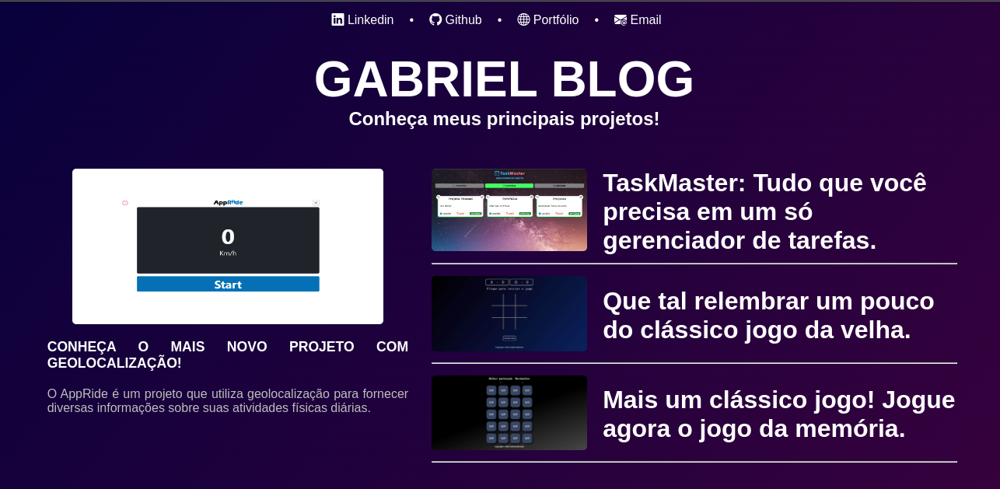
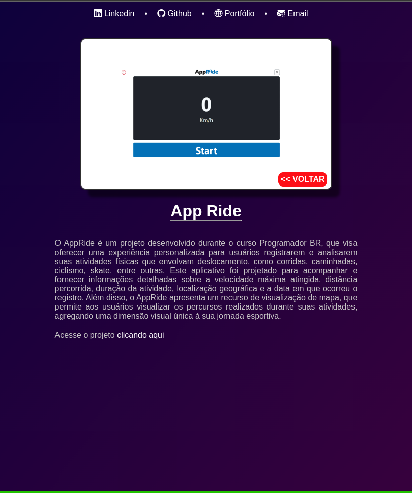

| Tela de inicial | Detalhes do projeto  |
|:-------------:|:------------:|
|  |  |

## 📚 Sobre o projeto 
Este projeto foi desenvolvido como parte do Santander Bootcamp 2023, com o objetivo de aplicar os conhecimentos iniciais adquiridos no framework Angular. 

 

## 🖥️ Tecnologias utilizadas

* HTML
* CSS
* Typescript
* Angular
* Bootstrap
---
 

  
  
       

